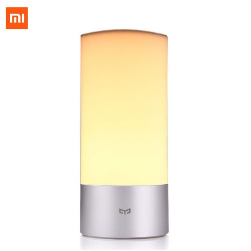

> **Warning**
> The bluetooth landscape in HA is currently evolving and at the moment there still seem to be some issues with Candela.
> Current status:
>
> - For HA prior to 2022.7.0 => use release v0.11.3
> - For HA 2022.7.0 => use release v1.0.1 (Candela does not seem to work)
> - For HA 2022.8.0+ => v1.1.0+ is compatible with and without the bluetooth integration (Candela is still WIP)
> - For HA 2022.9.0+ => v1.2.1+ is compatible with and without the bluetooth integration (Candela still not working)
> - For HA 2022.10.0+ => v1.2.2+ is compatible with the bluetooth integration and with esp bluetooth proxy (Candela control may work?)

# Home Assistant custom component for Yeelight Bedside lamp

This is a custom component for Home Assistant that allows the control of the Yeelight bedside Lamp via bluetooth. (Contrary to the wifi version, those lamps only have bluetooth control).



# Installation

This custom component can be installed in two different ways: `manually` or `using HACS`

## 1. Installation using HACS (recommended)

This repo is now in [HACS](https://hacs.xyz/).

1. Install HACS follow the instructions [here](https://hacs.xyz/docs/setup/prerequisites)
2. Search for `Yeelight bluetooth`
3. Install and enjoy automatic updates


## 2. Manual Installation

1. Download the `hass-yeelight_bt.zip` file from the
   [latest release](https://github.com/hcoohb/hass-yeelightbt/releases/latest).
2. Unpack the release and copy the `custom_components/yeelight_bt` directory
   into the `custom_components` directory of your Home Assistant
   installation.
3. Ensure bluez is installed and accessible from HA (refer to next section)
4. Add the `yeelight_bt` lights as described in next section.

## Ensure Host bluetooth is accessible from Home-Assistant

Since version 1.0.0, this component uses the [`bleak`](https://github.com/hbldh/bleak) python library to access bluetooth (as bluepy is not supported from HA 2022.07+). In order to scan and interact with bluetooth devices, bluez utility needs to be installed and the correct permissions must be given to HA:

- for **Home Assistant Operating System**:
  It should be all setup, at least for HA 2022.7+

- For **Home Assistant Container** in docker:

  Ensure your host has the `bluetoothctl` binary on the system (coming from `bluez` or `bluez-util` package, depending on the distro).  
  The docker-compose container (or equivalent docker command) should link _/var/run/dbus_ with host folder through a volume and _NET_ADMIN_ permission is needed. docker compose extract:

  ```yaml
  volumes:
    - /var/run/dbus:/var/run/dbus
  cap_add:
    - NET_ADMIN
    - NET_RAW
  network_mode: host
  ```

- For **Home Assistant Core** installed in a Virtualenv:

  Ensure your host has the `bluetoothctl` binary on the system (coming from `bluez` or `bluez-util` package, depending on the distro).  
  Make sure the user running HA belongs to the `bluetooth` group.

# Homeassistant component configuration

## Adding the device to HA

You must have the `bluetooth` integration enabled and configured (HA 2022.8+) or a connected ESPhome device running the bluetooth proxy (HA 2022.10+). The Lamps should be automatically discovered and you will receive a notification prompting you to add it.

The devices can also be added through the `integration menu` UI:

- In Configuration/Integrations click on the + button, select `Yeelight bluetooth` and you can either scan for the devices or configure the name and mac address manually on the form.  
  The light is automatically added and a device is created.

Please ensure the following steps prior to adding a new light:

- The light must NOT be connected with the official app (or any other device), else HA will not be able to discover it, nor connect to it.
- Once the light has been paired with this component, you should not try to connect it with the app, or the two will constantly fight for the connection.
- Some HA integrations still use some bluetooth libraries that take full control of the physical bluetooth adapter, in that case, other ble integration will not have access to it. So to test this component, best to disable all other ble integrations if you are unsure what ble lib they are using.

## Light pairing

1. If the light has been previously paired with another device, best to reset it following [this youtube video](https://www.youtube.com/watch?v=PnjcOSgnbAM)
2. The custom component will automatically request a pairing with the lamp if it needs to. When the pairing request is sent, the light will **pulse**. You then need to push the little button at the top of the lamp. Once paired you can control the lamp through HA

# A note on bleak and bluetooth in HA

Starting with 2022.08, HA is trying to provide a framework centered around the bleak library so that all components can use the same interface and avoid conflicts between the different ble libraries. This is early days and there is still some active work trying to stabilise everything but this integration component has now been converted to be compatible with HA `bluetooth` integration.

In the process, unfortunately it seems that the candela is not working at the moment.
I only have one yeelight bedside, so if you have issues with candela or multiple lights, please report an issue (with debugging logs) so we can try to sort it out.

# Debugging

Please ensure the following:

1. The xiaomi yeelight app is not being used and force shut (or even better to turn bt off if unsure).
2. the Yeelight_bt integration has been removed from HA.
3. HA has access to the bluetooth adapter (follow the section above in not on HAOS).
4. No other bluetooth integration are using something else than bleak library for bluetooth. If unsure, disable them.
5. The logging has been changed in HA to allow debugging of this component and bleak:
   In order to get more information on what is going on, the debugging flag can be enabled by placing in the `configuration.yaml` of Home assistant:

   ```yaml
   logger:
     default: warning
     logs:
       custom_components.yeelight_bt: debug
       bleak_retry_connector: debug
       bleak: debug
       # homeassistant.components.bluetooth: debug  # this can help if needed
       # homeassistant.components.esphome.bluetooth: debug  # this can help if needed
   ```

   NOTE: this will generate A LOT of debugging messages in the logs, so it is not recommended to use for a long time

6. The light has been fully reset so that it is not paired with any device.
7. Restart HA
8. Reinstall the yeelight_bt integration and find the light through a scan.
9. check the logs and report. Thanks

# Other info

Originally based on the work by Teemu Rytilahti [python-yeelightbt](https://github.com/rytilahti/python-yeelightbt), it has been completely re-written to improve stability and only focuses on the integration with HA.
